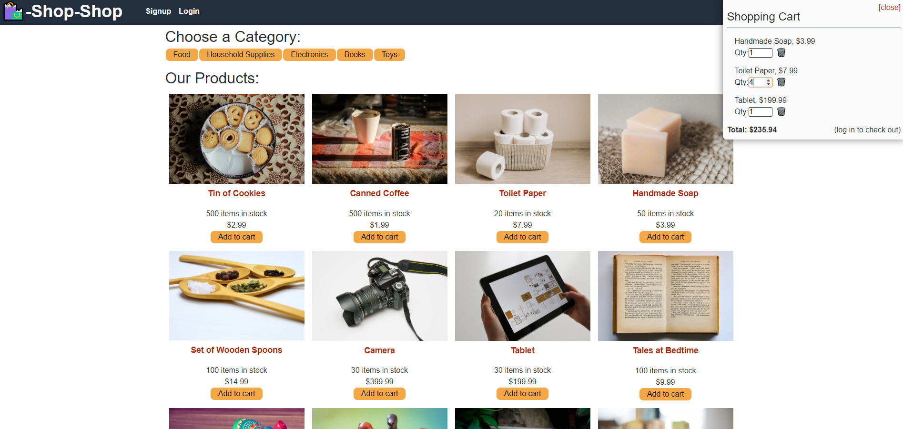

# Shop-Shop Redux Assignment
## Table of Contents
* [Project Description](#project-description)
* [Installation](#installation)
* [Questions](#questions)

[link](https://shop-shop-shop-shop.herokuapp.com/)

## Project Description
This app was part of an assignment to teach abour React's Context API as well as Redux. We were given starter code and asked to refactor first with Context API and then again with Redux. This app is an ecommerce website where you can add and remove items from a cart and checkout using Stripe. There is also a significant amount of IndexDB used throughout this app.

## Installation
This is a website application: please go to this [link](https://shop-shop-shop-shop.herokuapp.com/)
## Questions
* Please visit my [GitHub Profile](https://github.com/dalyd14)